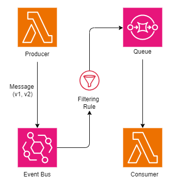

## About



This repository contains a demonstration of how to implement message versioning using SQS, Lambda and EventBridge.

The `infra` folder contains all the code needed to create the infrastructure, permissions and microsservices on AWS needed to run this demo. 

The `src` folder contains the source code of both Consumer and Producer microsservices written in .NET 6.

## Instalation 

Make sure you have .NET 6 and terraform installed on your machine.

```
terraform version
dotnet --info
```

Then just run `deploy.sh` script and check for the resources created in your AWS account.

## Usage

Execute `producer-lambda-function` function in your AWS account so that it publishes some events to EventBridge.

Then check which events `consumer-lambda-function` function received, according to the filtering rule created. 